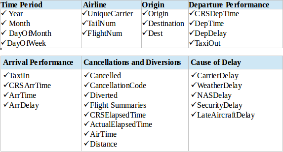
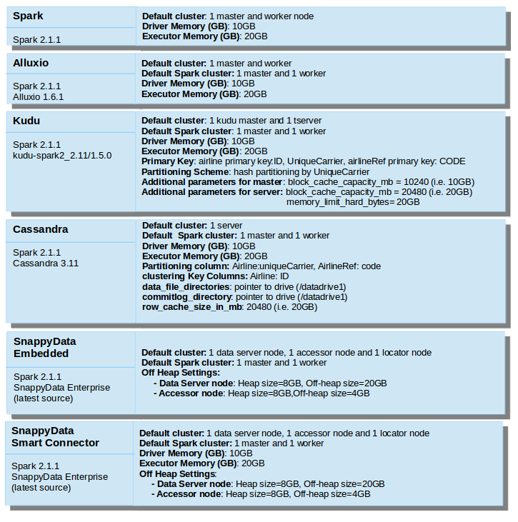
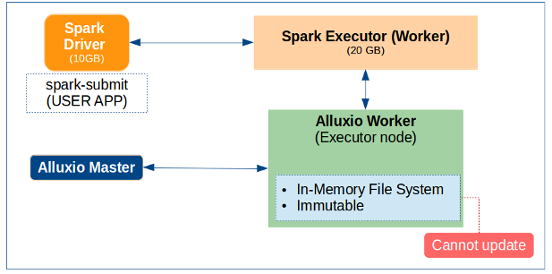
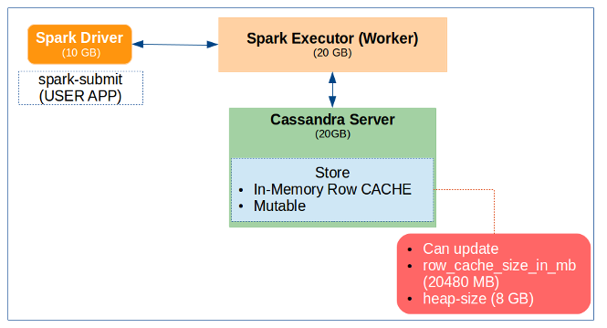
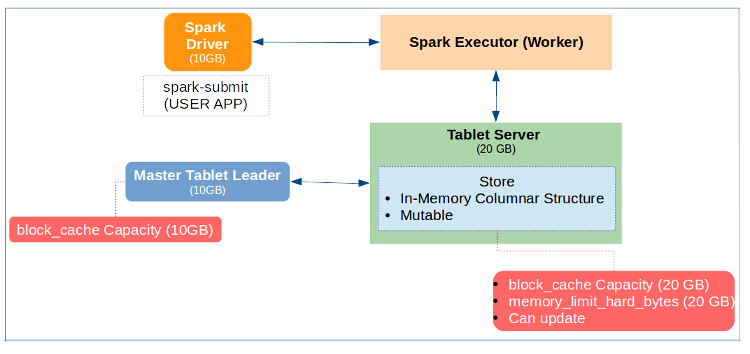
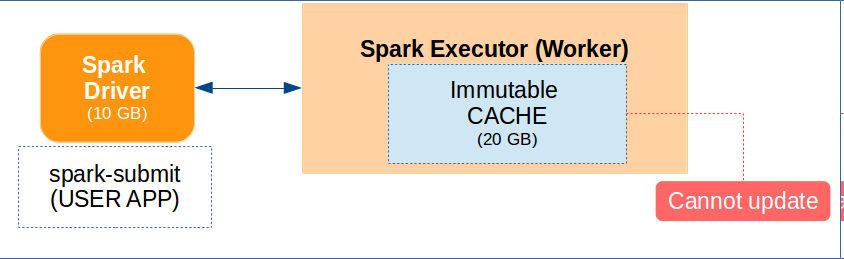
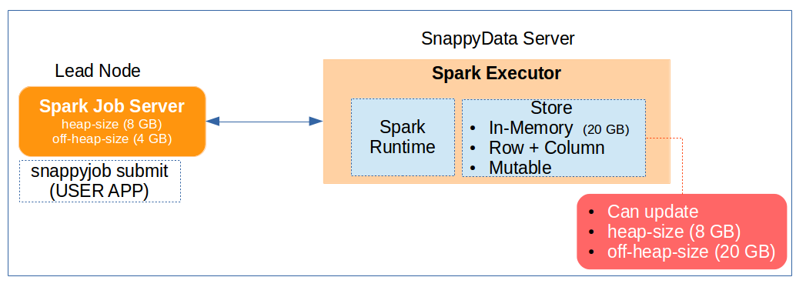

# Benchmark

## Run This Benchmark Yourself

This benchmark can be replicated using the machine configuration recommended in [system configuration](#sys-config).

<a id="data-set"></a>
## Benchmark Data Set

**The Airline** data set consists of flight arrival and departure details for all commercial flights from 1987 to 2017. In this benchmark, only specific data fields have been used in the queries. It is recommended that you [download the following data fields](https://www.transtats.bts.gov/DL_SelectFields.asp?Table_ID=236&DB_Short_Name=On-Time) for the years 1995-2015:



**The Airline Reference table** data set consists of code (UniqueCarrier) and description fields, and can be found [here](https://github.com/SnappyDataInc/snappydata/tree/master/examples/quickstart/data/airportcodeParquetData).


<a id="cluster-setup"></a>
## Cluster Setup and Product Details

The cluster setup and configuration parameters used for the products are:


*Cluster Setup details for all products*

###  Product Runtime Architecture
The runtime architecture is depicted in the following figures. Essentially, it consists a logical overview of the components and the configuration used for setting up the cluster.


*Alluxio's runtime architecture*


*Cassandra's runtime architecture*


*Kudu's runtime architecture*


*Spark's runtime architecture*


*SnappyData Embedded mode’s runtime architecture*


*SnappyData Smart Connector mode’s runtime architecture*

<a id="launch_run"></a>
## Launching Cluster and Running the Benchmark

Here you can find details on generating performance numbers for each product.

1. Creating the Spark cluster and running a Spark app to get the numbers. </p>
	Start the Spark cluster using the default configuration and required parameters mentioned in [Cluster Setup and Product Details](#cluster-setup) section.

	Below is the `spark-submit` command and the options used for getting Spark numbers:

  	```./bin/spark-submit --master spark://<master-host>:<master-port> --class LoadAndQuerySparkApp --jars <path to jar location>/spark-hive_2.11-1.2.0.jar --driver-memory 10G --executor-memory 20G <app- jar>```

2. Creating SnappyData + Spark cluster, running the SnappyData Spark application and SnappyData job to get the numbers for SnappyData Embedded and SnappyData Smart Connector mode.</p>
	Start the SnappyData + Spark cluster using the default configurations and required parameters mentioned in [Cluster Setup and Product Details](#cluster-setup) section.

	Below is the `spark-submit` command and the options used for getting the SnappyData Smart Connector Mode numbers:
	
	  ```./bin/spark-submit --master spark://<master-host>:<master-port> --class LoadAndQuerySnappySparkApp  --driver-memory 10G --executor-memory 20G --conf spark.memory-manager=org.apache.spark.memory.SnappyUnifiedMemoryManager --conf spark.snappydata.store.memory-size=4g --jars <snappydata-core_2.11-1.0.0.jar path> <app-jar> <SnappyData Locator host>:<SnappyData locator port>```

	Below is the `snappy-job submit` command and the options used for getting SnappyData Embedded Mode numbers:

	  ```./bin/snappy-job.sh submit --class LoadAndQueryPerfSnappyJob --app-name myapp --app-jar <app-jar-path>```

3. Creating Alluxio + Spark cluster and running Spark application to get the numbers.</p>
	Start the Alluxio + Spark cluster using the default configurations and required parameters mentioned in the [Cluster Setup and Product Details](#cluster-setup) section.

	Below is the `spark-submit` command and the options used for getting Alluxio Connector Mode numbers:

  	```./bin/spark-submit --master spark://<master-host>:<master-port> --class LoadAndQueryPerfAlluxioSparkApp --jars <path to jar location>/alluxio-1.6.1-spark-client.jar --driver-memory 10G --executor-memory 20G <app-jar-path>```

4. Creating Kudu + Spark cluster and running Spark app to get the numbers</p>
	Start the Kudu + Spark cluster using the default configurations and required parameters mentioned in the [Cluster Setup and Product Details](#cluster-setup) section.</p>

	Below is the `spark-submit` command with the options used for getting Kudu Connector Mode numbers:
	
  	```./bin/spark-submit --master spark://<master-host>:<master-port> --class LoadAndQueryPerfKuduSparkApp --jars <path to jar location>/kudu-client-1.5.0.jar,<path to jar location>/kudu-spark2_2.11-1.5.0.jar --driver-memory 10G --executor-memory 20G <app-jar-path>```


5. Creating Cassandra + Spark cluster and running Spark app to get the numbers</p>
    Start the Cassandra + Spark cluster using the default configurations and required parameters mentioned in [Cluster Setup and Product Details](#cluster-setup) section.

	Below is the `spark-submit` command and the options used for getting Cassandra Connector Mode numbers:

 	 ```./bin/spark-submit --master spark://<master-host>:<master-port> --class LoadAndQueryPerfCassandraSparkApp --jars <path to jar location>/spark-hive_2.11-1.2.0.jar --conf spark.cassandra.connection.host=127.0.0.1 --conf spark.local.dir=<path to temp dir>  --packages datastax:spark-cassandra-connector:2.0.5-s_2.11  --driver-memory 10G --executor-memory 20G <app-jar-path>```

<a id="sys-config"></a>
## System Configuration
We have used a single machine with the following configuration for this benchmark:

| Operating System | Configuration |
|--------|--------|
|Ubuntu 16.04.1 LTS|GNU/Linux 4.4.0-98-generic x86_64 </p>Azure VM with:</p>- 16 Cores</p>- 112 GB RAM|