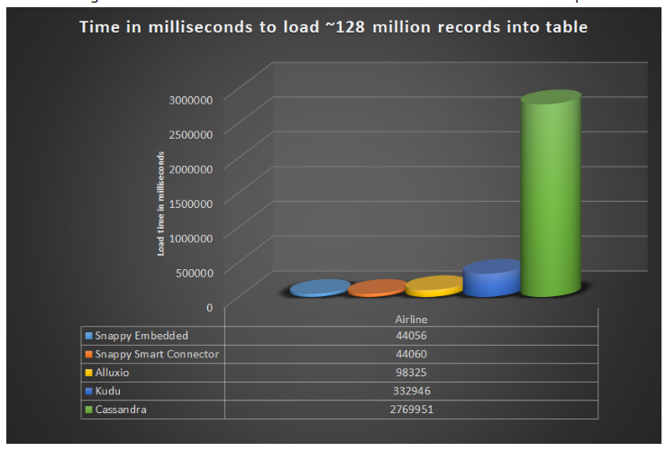
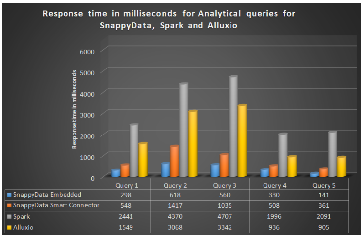
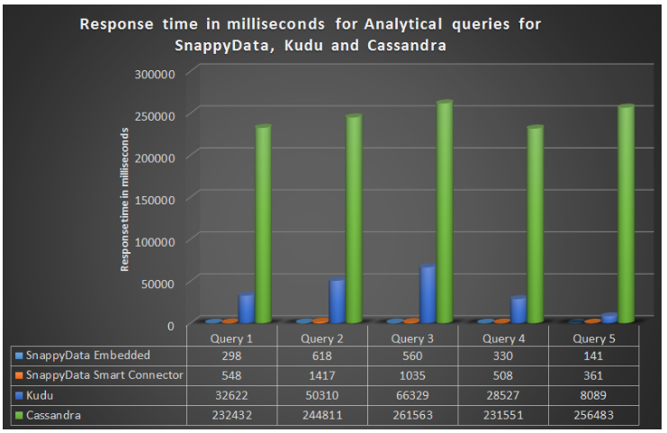
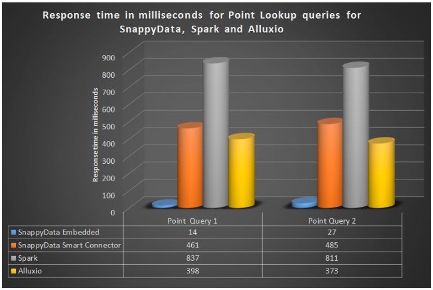
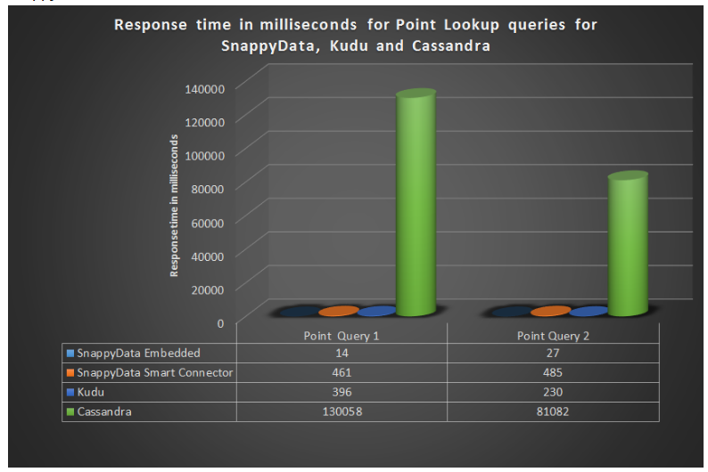
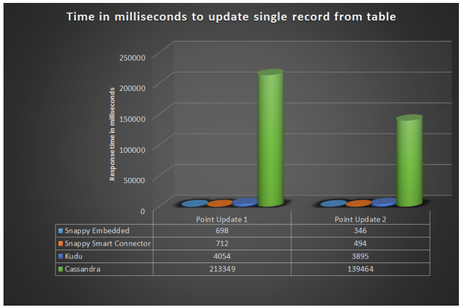

# Benchmarking Apache Spark with Cassandra, Kudu, Alluxio, Spark cache and SnappyData

## Run This Benchmark Yourself

This benchmark can be replicated using the machine configuration recommended in [system configuration](#sys-config).

<a id="data-set"></a>
## Benchmark Data Set

**The Airline** data set consists of flight arrival and departure details for all commercial flights from 1987 to 2017. In this benchmark, only specific data fields have been used in the queries. It is recommended that you [download the following data fields](https://www.transtats.bts.gov/DL_SelectFields.asp?Table_ID=236&DB_Short_Name=On-Time) for the years 1995-2015:

<p align="center"> </br></p>

**The Airline Reference table** data set consists of code (UniqueCarrier) and description fields and can be found [here](https://github.com/SnappyDataInc/snappydata/tree/master/examples/quickstart/data/airportcodeParquetData).


<a id="cluster-setup"></a>
## Cluster Setup and Product Details

The cluster setup and configuration parameters used for the products are:

<p align="center"> </br>Cluster setup details</p>

###  Product Runtime Architecture
The runtime architecture is depicted in the following figures. Essentially, it consists a logical overview of the components and the configuration used for setting up the cluster.

<p align="center"> </br>Alluxio's runtime architecture</p>

<p align="center"> </br>Cassandra's runtime architecture</p>

<p align="center"> </br>Kudu's runtime architecture</p>

<p align="center"> </br>Spark's runtime architecture</p>

<p align="center"> </br>SnappyData Embedded Mode's runtime architecture</p>

<p align="center"> </br>SnappyData Smart Connector Mode's runtime architecture</p>

<a id="launch_run"></a>
## Launching Cluster and Running the Benchmark

Here you can find details on generating performance numbers for each product.

1. Creating the Spark cluster and running a Spark app to get the numbers. </p>
	Start the Spark cluster using the default configuration and required parameters mentioned in [Cluster Setup and Product Details](#cluster-setup) section.

	Below is the `spark-submit` command and the options used for getting Spark numbers:

  	```./bin/spark-submit --master spark://<master-host>:<master-port> --class LoadAndQuerySparkApp --jars <path to jar location>/spark-hive_2.11-1.2.0.jar --driver-memory 10G --executor-memory 20G <app- jar>```

2. Creating SnappyData + Spark cluster, running the SnappyData Spark application and SnappyData job to get the numbers for SnappyData Embedded and SnappyData Smart Connector mode.</p>
	Start the SnappyData + Spark cluster using the default configurations and required parameters mentioned in [Cluster Setup and Product Details](#cluster-setup) section.

	Below is the `spark-submit` command and the options used for getting the SnappyData Smart Connector Mode numbers:
	
	  ```./bin/spark-submit --master spark://<master-host>:<master-port> --class LoadAndQuerySnappySparkApp  --driver-memory 10G --executor-memory 20G --conf spark.memory-manager=org.apache.spark.memory.SnappyUnifiedMemoryManager --conf spark.snappydata.store.memory-size=4g --jars <snappydata-core_2.11-1.0.0.jar path> <app-jar> <SnappyData Locator host>:<SnappyData locator port>```

	Below is the `snappy-job submit` command and the options used for getting SnappyData Embedded Mode numbers:

	  ```./bin/snappy-job.sh submit --class LoadAndQueryPerfSnappyJob --app-name myapp --app-jar <app-jar-path>```

3. Creating Alluxio + Spark cluster and running Spark application to get the numbers.</p>
	Start the Alluxio + Spark cluster using the default configurations and required parameters mentioned in the [Cluster Setup and Product Details](#cluster-setup) section.

	Below is the `spark-submit` command and the options used for getting Alluxio Connector Mode numbers:

  	```./bin/spark-submit --master spark://<master-host>:<master-port> --class LoadAndQueryPerfAlluxioSparkApp --jars <path to jar location>/alluxio-1.6.1-spark-client.jar --driver-memory 10G --executor-memory 20G <app-jar-path>```

4. Creating Kudu + Spark cluster and running Spark app to get the numbers</p>
	Start the Kudu + Spark cluster using the default configurations and required parameters mentioned in the [Cluster Setup and Product Details](#cluster-setup) section.</p>

	Below is the `spark-submit` command with the options used for getting Kudu Connector Mode numbers:
	
  	```./bin/spark-submit --master spark://<master-host>:<master-port> --class LoadAndQueryPerfKuduSparkApp --jars <path to jar location>/kudu-client-1.5.0.jar,<path to jar location>/kudu-spark2_2.11-1.5.0.jar --driver-memory 10G --executor-memory 20G <app-jar-path>```


5. Creating Cassandra + Spark cluster and running Spark app to get the numbers</p>
    Start the Cassandra + Spark cluster using the default configurations and required parameters mentioned in [Cluster Setup and Product Details](#cluster-setup) section.

	Below is the `spark-submit` command and the options used for getting Cassandra Connector Mode numbers:

 	 ```./bin/spark-submit --master spark://<master-host>:<master-port> --class LoadAndQueryPerfCassandraSparkApp --jars <path to jar location>/spark-hive_2.11-1.2.0.jar --conf spark.cassandra.connection.host=127.0.0.1 --conf spark.local.dir=<path to temp dir>  --packages datastax:spark-cassandra-connector:2.0.5-s_2.11  --driver-memory 10G --executor-memory 20G <app-jar-path>```

<a id="sys-config"></a>
## System Configuration
We have used a single machine with the following configuration for this benchmark:

| Operating System | Configuration |
|--------|--------|
|Ubuntu 16.04.1 LTS|GNU/Linux 4.4.0-98-generic x86_64 </p>Azure VM with:</p>- 16 Cores</p>- 112 GB RAM|

## Summary of our Key Findings

- While Spark’s built-in in-memory caching is convenient, it is not the fastest. What you might find interesting is that Spark’s parquet storage is faster than its in-process caching performance. It is not just about managing state in-memory. The structure, the optimizations in the engine are much more paramount. 
- [SnappyData’s embedded mode](https://snappydatainc.github.io/snappydata/affinity_modes/embedded_mode/) (Store embedded within Spark execution engine) is faster than the other compared products, as described below:
	- For **analytical queries**, it is faster than Spark by *6X - 15X* times, Alluxio by *3X - 6X* times, Kudu by *80X - 120X* times  and Cassandra by *400X - 1800X* times.
	- For **load performance**, it is faster than Alluxio by *2X* times, Kudu by *8X* times and Cassandra by *60X* times.
	- For **point query performance**, it is faster than Spark by *30X - 60X* times, Alluxio by *15X - 30X* times, Kudu by *10X - 30X* times and Cassandra by *3000X - 9000X* times. 
	- For **update performance**, it is faster than Kudu by *10X - 30X* times, and Cassandra by *3000X - 9000X* times.
- SnappyData in embedded mode avoids unnecessary copying of data from external processes and optimizes Spark’s catalyst engine in a number of ways (refer to the blog for more details on how SnappyData achieves this performance gain). 
- [SnappyData’s Smart connector mode](https://snappydatainc.github.io/snappydata/affinity_modes/connector_mode/#snappydata-smart-connector-mode) (Store cluster is isolated from Spark cluster) is also much faster than other compared products, as described below: 
	- For **analytical queries**, it is faster than Spark by *3X - 6X* times, Alluxio by *2X - 3X* times, Kudu by *20X - 65X* times and Cassandra by *200X - 700X* times. 
	- For **load performance**, it is faster than Alluxio by *2X* times, Kudu by *8X* times and Cassandra by *60X* times. 
	- For  **point query performance**, it is faster than Spark by *2X - 3X* times, Cassandra by *150X - 300X* times. 
	It has been noted that Alluxio’s performance is approximately the same as SnappyData and Kudu’s performance is better than SnappyData in the Smart Connector mode.
	- For update performance, it is faster than Kudu by *6X - 8X* times, and Cassandra by *250X - 300X* times.
- We observed Alluxio to easily beat all the other store options (except SnappyData). We think this is primarily attributed to its block-oriented storage layer and seems to have also been tuned to work with Spark more natively.  But at the same time, it does not support data mutation, which other stores do.
- Cassandra, while likely being the most popular storage option with Spark, was the slowest. This is primarily attributed to how Cassandra internally manages rows. It is a row-oriented database and lacks all the optimizations commonly seen in columnar databases. Analytical queries tend to scan all rows and this results in  over pointer chasing - which is very expensive in modern-day multi-core architectures. Moreover, the data format differences result in high serialization and deserialization overhead.

The following charts display the performance results based on which, the key findings were derived.
<table BORDER="0" WIDTH="100%" CELLPADDING="0" CELLSPACING="0" align="center" bgcolor="#ccccff">
  <tr> <th colspan="2"><p align="center"> </br>Load Performance</p></th>
 </tr>
 <tr> <th>  </br>Analytical Performance
 </th></tr>  
 <tr> <th> <p> </br>Point Lookup Performance</p></th> </tr>
 <tr> <th colspan="2"> </br>Update Performance
</th> </tr>
</table>  